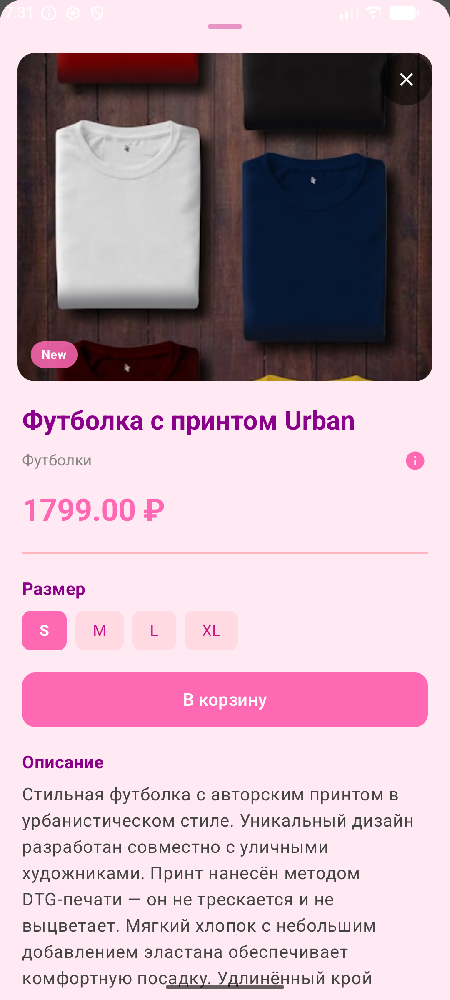
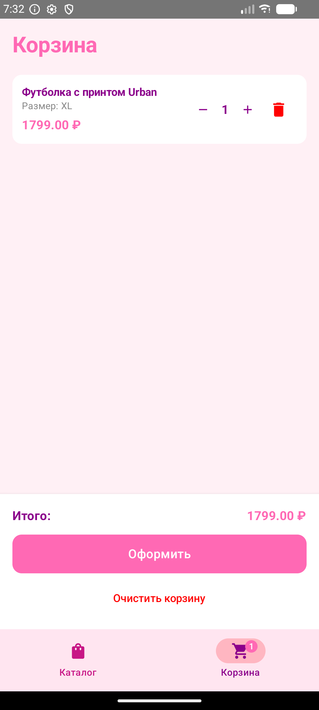

# 🐾 Розовая Пантера

Онлайн-магазин одежды и обуви — мобильное приложение на Android (Kotlin, Jetpack Compose).

## 📱 О приложении

Мобильное приложение для просмотра каталога товаров, добавления в корзину и оформления заказа. Данные загружаются из API, при недоступности сети используется локальный JSON. Корзина сохраняется локально и восстанавливается при перезапуске.

## 📸 Скриншоты

| Каталог                                          | Детали товара                                    | Корзина |
|--------------------------------------------------|--------------------------------------------------|---------|
|  |  |  |

## 🛠 Стек технологий

- **Платформа**: Android
- **Язык**: Kotlin
- **UI**: Jetpack Compose + Material3
- **Архитектура**: MVVM + Repository
- **Сеть**: Retrofit + Gson
- **Изображения**: Coil
- **Навигация**: Navigation Compose
- **Хранение**: SharedPreferences (корзина), Assets (локальный JSON)
- **Минимальная версия Android**: API 24 (Android 7.0)
- **Среда разработки**: Android Studio

## 🚀 Как запустить

1. Склонируйте репозиторий:
   ```bash
   git clone https://github.com/FEIP-FEFU-Mobile-Spring-2026/team-designers.git
   cd team-designers